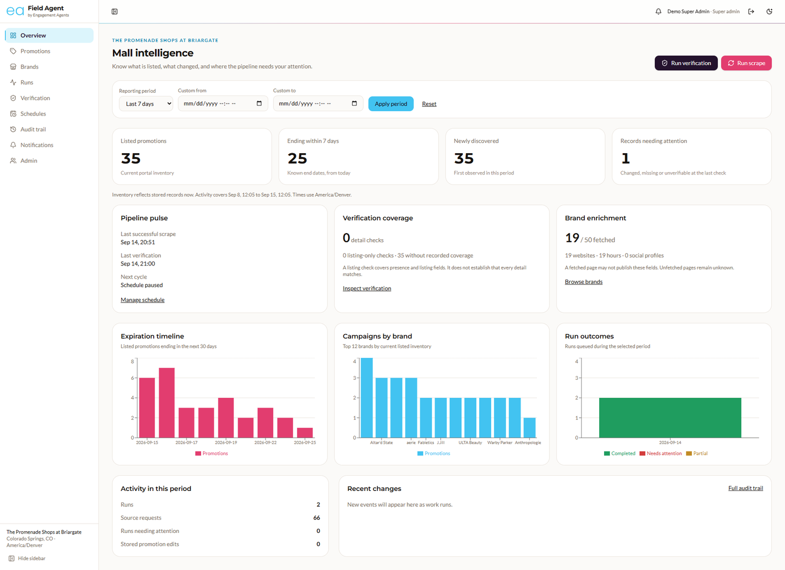
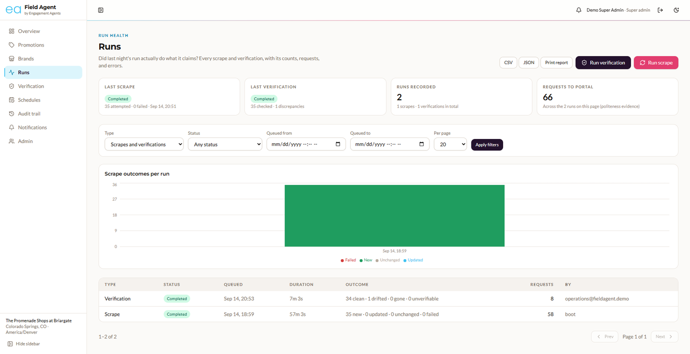
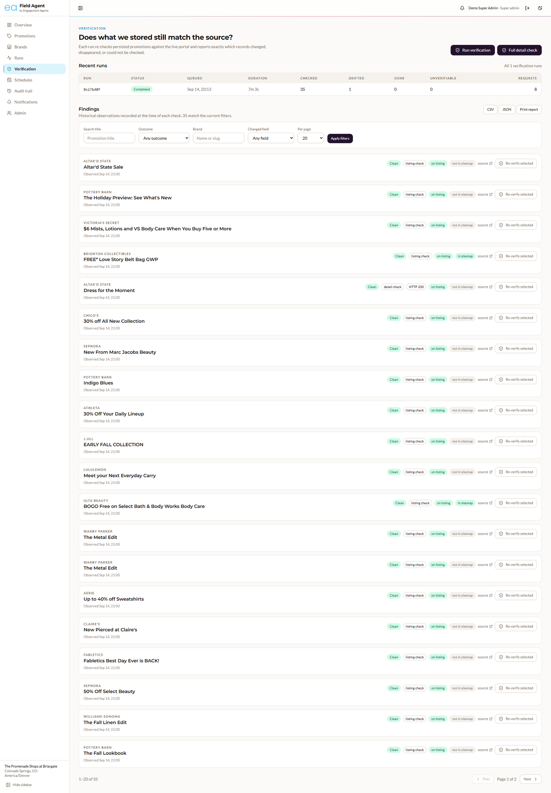

<p align="center">
  <picture>
    <source media="(prefers-color-scheme: dark)" srcset="docs/brand/ea-logo-dark.png">
    
  </picture>
</p>

<h1 align="center">Promotions Aggregator · Single-Mall MVP</h1>

<p align="center"><code>field-agent</code> · a take-home for Engagement Agents by Alabura</p>

<p align="center">
  <a href="https://github.com/Alabs02/field-agent/actions/workflows/ci.yml"></a>
  <a href="https://field-agent.up.railway.app"></a>
  <a href="./LICENSE"></a>
</p>

An engagement agent that walks the mall for you. It scrapes the promotions a shopping-center portal is running, enriches each one with the brand's hours, website, and social links, re-verifies what it stored against the live site, and serves it all through a typed API and a UI built for the people who act on it.

> Take-home for Engagement Agents: **Promotions Aggregator (Single-Mall MVP)**. Target portal: [The Promenade Shops at Briargate](https://www.thepromenadeshopsatbriargate.com/sales/).
> Read [DESIGN.md](./DESIGN.md) for the decisions and [ASSUMPTIONS.md](./ASSUMPTIONS.md) for how the brief was interpreted and what the live runs taught.

## Start here

| Try it hosted | Run it locally | Read the decisions |
|---|---|---|
| Open [field-agent.up.railway.app/app](https://field-agent.up.railway.app/app) and sign in as `reviewer@fieldagent.demo` with the password `FieldAgent-Demo-2026!` (all five accounts are under [Demo accounts](#demo-accounts)). The first page after a quiet spell takes about a second longer: the database scales to zero when idle. | `git clone https://github.com/Alabs02/field-agent.git && cd field-agent && docker compose up --build`. Real promotions appear at http://localhost:3000/app (overview) and `/app/promotions` about two minutes later. | [DESIGN.md](./DESIGN.md): what was chosen and why, written before the code. [ASSUMPTIONS.md](./ASSUMPTIONS.md): how the brief was read, and what the live runs taught. |

## Contents

- [Screenshots](#screenshots)
- [Run it](#run-it): [Prerequisites](#prerequisites) · [Quick start](#quick-start) · [Local development without Docker](#local-development-without-docker)
- [Use it](#use-it): [Trigger a scrape](#trigger-a-scrape) · [Follow the job](#follow-the-job) · [Run a verification](#run-a-verification) · [View the UI](#view-the-ui) · [Operations dashboard](#operations-dashboard) · [Demo accounts](#demo-accounts)
- [How it is built](#how-it-is-built): [What you get](#what-you-get) · [API surface](#api-surface) · [Politeness](#politeness)
- [Operate it](#operate-it): [Environment variables](#environment-variables) · [Deploying](#deploying) · [Tests](#tests)
- [Honesty](#honesty): [Known limitations](#known-limitations) · [Hours spent](#hours-spent) · [License](#license)

## Screenshots

Captured from the hosted demo. Expected files: `docs/screenshots/overview.png`, `promotions.png`, `runs.png`, `verification.png`, `lander.png`.

<!-- Un-comment once the PNGs exist in docs/screenshots/ (1440 px wide, light theme).
<table>
  <tr>
    <td><br><sub>Overview at <code>/app</code>: inventory, period activity, coverage, and the pipeline's pulse.</sub></td>
    <td><br><sub>Promotions at <code>/app/promotions</code>: filters, table view, and the By-brand grouping.</sub></td>
  </tr>
  <tr>
    <td><br><sub>Runs: outcomes, phase timeline, requests, errors, retry and cancel.</sub></td>
    <td><br><sub>Verification report: processing result, data verdict, coverage, before/after.</sub></td>
  </tr>
  <tr>
    <td colspan="2"><br><sub>Lander at <code>/</code>: the verification band reads the last real run.</sub></td>
  </tr>
</table>
-->

## Run it

Docker Compose brings up Postgres, Redis, the API, the worker, and the UI, and runs the first scrape on boot. Without Docker, Node 22 and pnpm 10 are enough.

### Prerequisites

- Docker 24+ with Compose v2. That is all you need to run it.
- For development without Docker: Node 22 and pnpm 10 (`corepack enable`).

### Quick start

```bash
git clone https://github.com/Alabs02/field-agent.git
cd field-agent
docker compose up --build
```

No `.env` is needed; every setting has a default. The stack comes up in this order: Postgres and Redis → `migrate` (applies migrations, seeds the portal row and demo users) → `api` → `worker` → `web`.

| Service | URL |
|---|---|
| Web UI | http://localhost:3000/app |
| API docs (OpenAPI) | http://localhost:4000/docs |
| API health | http://localhost:4000/health |
| Queue dashboard (Bull Board) | http://localhost:4000/admin/queues |

On first boot, with no completed scrape in the database, the API enqueues one scrape automatically (`SCRAPE_ON_BOOT=true`). Real promotions appear in the UI about two minutes later. Restarts never re-scrape on their own.

The `migrate` service prints the five demo accounts as it seeds them (`docker compose logs migrate`); they are the same as the table under [Demo accounts](#demo-accounts) below. Locally auth is off, as the brief asks, so nothing needs a sign-in. To try the roles locally: `AUTH_REQUIRED=true docker compose up`.

### Local development without Docker

```bash
pnpm install
pnpm bootstrap                               # datastores in Docker, .env, migrate, seed, prints the demo accounts
pnpm dev                                     # api :4000, worker, web :3000
```

`pnpm bootstrap` starts only Postgres and Redis in Docker (host ports 5433 and 6380), copies `.env.example` to `.env` if you have none, applies migrations, and seeds the portal row and demo accounts. The apps read the root `.env` on `pnpm dev`. Other useful scripts: `pnpm seed` (migrate + seed again), `pnpm demo:credentials`, `pnpm demo:drift` / `pnpm demo:undrift`.

## Use it

The API enqueues jobs and never scrapes inline. Every step below can be done from the UI or with curl.

### Trigger a scrape

```bash
curl -s -X POST http://localhost:4000/scrape
```

```json
{ "jobId": "2be2efee-…", "runId": "2be2efee-…", "reused": false, "statusUrl": "/scrape/2be2efee-…" }
```

The request returns in well under a second with `202 Accepted`. Calling it again while that run is active returns the same job with `reused: true` and `200`. Pass `{"force": true}` to re-fetch every page even when the sitemap says nothing changed.

### Follow the job

```bash
curl -s http://localhost:4000/scrape/<jobId>
```

The response carries the phase (`discover → listing → details → brands → finalize`), progress, the five counts the brief asks for, brand counts, the number of requests made against the portal, and every error with its stage, code, and URL.

```json
{
  "status": "completed",
  "effectiveStatus": "completed",
  "queueState": "completed",
  "phase": "done",
  "progress": 100,
  "counts": { "attempted": 30, "persisted": 24, "updated": 1, "skipped": 0, "failed": 5 },
  "brandCounts": { "attempted": 17, "failed": 0 },
  "requestsMade": 51,
  "errors": [{ "stage": "detail", "code": "fetch_timeout", "url": "https://…/deals/3444167/", "sourceId": "3444167", "…": "…" }]
}
```

Invariant: `attempted = persisted + updated + skipped + failed`. `skipped` means "seen and unchanged", never "ignored". A second run typically reports `skipped ≈ 29` and about 20 requests, because unchanged pages are detected from the sitemap and skipped.

`effectiveStatus` reconciles the database row with the queue: a run that says `running` while its heartbeat is stale and no worker holds the job is reported as `stalled`.

### Run a verification

```bash
curl -s -X POST http://localhost:4000/verify
curl -s http://localhost:4000/verify/<runId>
```

The report names every promotion it checked and, for each discrepancy, the field with its before and after value:

```json
{
  "result": "discrepancies",
  "clean": false,
  "summary": { "checked": 30, "clean": 29, "changed": 1, "missingAtSource": 0, "unverifiable": 0, "requestsMade": 13, "sampleRate": 0.2 },
  "findings": [
    {
      "kind": "changed",
      "promotion": { "title": "50% Off Select Beauty", "brandName": "Sephora", "…": "…" },
      "fieldChanges": [{ "field": "imageUrl", "before": "https://cdn-files.eu.placewise.com/…", "after": "https://placewise.imgix.net/…GettyImages…" }],
      "evidence": { "checkedVia": "detail", "detailStatus": 200, "inListing": true, "inSitemap": false }
    }
  ]
}
```

A run with nothing persisted returns `result: "nothing_to_verify"`, never `clean`. Clean findings are stored too, so the report proves what was checked. Verification costs a handful of requests (sitemap, listing, and only the flagged or sampled detail pages), not a full re-scrape.

To see the report catch drift on demand, edit a stored row and verify again:

```bash
docker compose exec api node dist/cli.js drift      # edits a few persisted promotions locally
curl -s -X POST http://localhost:4000/verify
```

### View the UI

- **/**: a marketing lander proposed for Engagement Agents' own site (beyond the brief). The product lives under **/app**.

- **/app**: the operations overview. What is listed, what changed in the reporting period, and whether the pipeline needs attention (see [Operations dashboard](#operations-dashboard)). Legacy promotion-filter links to `/app?search=…` redirect to the promotions page.
- **/app/promotions**: cards, a dense table (dates, days left, first seen, last seen on the source, detail-fetch time, verification coverage, changed fields), and a **By brand** view whose pages count brands and show each brand's complete filtered group. Search, brand, collection, date range, verification outcome, source presence, freshness, first-seen range, "ending within 7 days" and "needs attention" filters, all in the URL.
- **/app/promotions/:id**: full description, dates and their provenance, brand panel, verification history, and the stored record's change history.
- **/app/brands** and **/app/brands/:slug**: search, category, store-data and sort filters with pagination; the detail page carries the brand's data-change history.
- **/app/runs** and **/app/runs/:id**: run health with type, status and date filters; the detail page shows heartbeat, elapsed time, attempts, source requests, the cooldown reason, links to the parent run or scheduled cycle, and **Retry** / **Cancel**.
- **/app/verify** and **/app/verify/:runId**: verification reports that separate the processing result from the data verdict, state their coverage, and offer targeted re-verification from any finding; the index page lists every finding with outcome, brand, field and search filters.
- **/app/schedules**, **/app/audit**, **/app/notifications**: the shared portal schedule, the append-only audit trail, and the in-app notification feed.

Empty states are honest: this portal lists no per-brand social accounts, so the UI says "Socials not listed on portal" rather than inventing icons. Missing values read as "Not available" or "Not checked", never a dash.

### Operations dashboard

Built after the core brief; the walkthrough below follows one connected story.

**Overview (`/app`).** Inventory numbers describe stored records now: listed promotions (the portal's current inventory), ending within seven days (known end dates only; records without one are counted separately), records needing attention (changed, missing or unverifiable at their last check), verification coverage (detail checks and listing-only checks are different claims) and brand enrichment (a fetched store page that publishes no website is "not listed", not "missing"). Activity numbers cover the reporting period (24 hours, 7 days by default, 30 days, or custom dates): newly discovered promotions, runs, source requests, runs needing attention and stored edits. Every tile links to the filtered list behind it, and every total is a database aggregate over the same filter, never a count of the loaded page. Times are America/Denver.

**Manual controls.** *Run scrape* offers an incremental refresh (skips pages the sitemap says are unchanged) or a full refresh; *Run verification* offers a quick check (listing for every record, detail pages for flagged records and a sample) or a full detail check. The dialog shows the scope, the sampling rate and the source's request spacing before anything is queued. Launching opens the run; a header pill stays visible while work is queued or running. An identical launch while one is active reuses the active run. Reviewers get the incremental and quick options with a five-minute cooldown per action; operations, data engineers and super admins get the advanced options too. Every role draws from the same source request budget.

**Retry and cancel.** Failed, partially failed and cancelled runs can be retried; the new run links back to the original, which is kept. Queued and running work can be cancelled: a queued job is removed at once, a running one shows "Cancellation requested" until the worker acknowledges within a few seconds. A stalled run (no heartbeat for 60 seconds) must be cancelled before it is retried, so two workers never process the same run.

**Schedules.** One shared schedule for this portal, disabled by default with a daily interval. Presets of 1, 6, 12 and 24 hours, or any whole number of hours up to 168; verification coverage quick or full. Enabling it sets the first due time one interval from now; *Run now* is explicit. A cycle verifies the stored baseline first, then runs the incremental refresh, so evidence of drift is recorded before stored values change. Discrepancies let the refresh continue; a failed or cancelled verification stops it. An empty database bootstraps the other way round (scrape, then verify). A due cycle that finds work already active is skipped, recorded as such, and the schedule moves to the next interval; nothing accumulates. The page shows the next due time, the last actual start, the last outcome and who changed the configuration.

**Audit trail.** Append-only, enforced by a database trigger, and written in the same transaction as the change it records: run launches, status transitions, cancellation requests and retries; promotion creation, meaningful edits, removal, reappearance and identity relinking; brand metadata changes; verification observations; schedule changes, started, skipped and finished cycles; exports; role changes. Each event carries the actor, the entity's label at that time, the related run, a severity and the before/after values, so history keeps the original title after a later edit. "A discrepancy observed at the source" (`verification.observed`, `verification.drift_detected`) and "a stored record updated by scraping" (`promotion.updated`) are different actions. History starts with migration `0001`; older runs predate it and no events are reconstructed.

**Notifications.** The header bell and `/app/notifications` show one summary per meaningful transition: a run completing, completing with errors, failing, stalling or being cancelled; drift detected by a verification; a source block; a schedule change or a finished or skipped cycle. Never one message per changed record. Read state is stored per user when signed in and in the browser in open local mode.

**Exports.** Promotions, brands, runs, verification findings and audit events export as CSV, JSON or a printable report using the same filters and sorting as the screen, across every page. CSV uses readable column names, escapes correctly and neutralises spreadsheet formula prefixes; JSON carries complete structured values plus metadata (portal, timezone, filters, generated time, total); the print layout carries the report title, portal, filters, timezone, generated time and totals with page breaks between records. The audit trail records "Export generated"; it does not claim the browser saved the file. Exports over 10,000 records are refused with a clear message rather than truncated.

### Demo accounts

Seeded by `migrate` on `docker compose up`, by `pnpm bootstrap`, and on every Railway deploy. The same table is printed to the terminal each time (`pnpm demo:credentials` prints it again). Password for all five: `FieldAgent-Demo-2026!` (override with `SEED_DEMO_PASSWORD`). Sign in at `/login`; the login page also lists them.

| Email | Role | Can |
|---|---|---|
| `super.admin@fieldagent.demo` | Super admin | read · scrape · verify · advanced options · schedules · admin (queue dashboard, users) |
| `operations@fieldagent.demo` | Operations | read · scrape · verify · advanced options · schedules |
| `data.engineer@fieldagent.demo` | Data engineer | read · scrape · verify · advanced options · schedules |
| `account.manager@fieldagent.demo` | Account manager | read · export |
| `reviewer@fieldagent.demo` | Reviewer | read · export · bounded scrape and verification (incremental and quick, five-minute cooldown) · schedules |

Roles exist only when `AUTH_REQUIRED=true` (the hosted demo, or `AUTH_REQUIRED=true docker compose up` locally). With it off, the brief's default, the API and the UI are open and the login page says so.

## How it is built

A pnpm and Turborepo monorepo where the shared Zod schemas are the single contract from scraper output to UI props. The UI wears Engagement Agents' brand (sky, pink and plum from their stylesheet, Montserrat and Lato, the `ea` mark) with the contrast bar kept: see [docs/brand](./docs/brand/README.md).

### What you get

| Piece | Where | What it does |
|---|---|---|
| `apps/api` | Fastify 5 | Typed REST API. Every response is serialized against the shared Zod schemas. Enqueues jobs through one launch path, never scrapes inline; runs the schedule and run-health monitor; serves exports. |
| `apps/worker` | BullMQ | Scrape and verification jobs. Retries, backoff, per-job timeout, heartbeat, cooperative cancellation, honest counts. |
| `apps/web` | Next.js 16 | Operations overview, promotions (cards, table, grouped by brand), brands, run health with retry and cancel, verification reports and findings, schedules, audit trail, notifications. |
| `packages/shared` | Zod | The one source of truth: scraper output → job payloads → API contract → UI props. |
| `packages/scraper` | got-scraping + cheerio | Portal adapter, politeness throttle, parsers, and the verification diff. Tested against captured real pages. |
| `packages/db` | Drizzle + Postgres | Schema, migrations, repositories. |
| `packages/queue` | BullMQ | Queue factories and job defaults. |

### API surface

| Method | Path | Notes |
|---|---|---|
| GET | `/health` | `{status, checks:{db,redis}, version, uptimeSec, authRequired}` |
| GET | `/promotions` | `search, startDate, endDate, brand, page, pageSize` plus `sort, collection, verification, presence, freshness, firstSeenFrom, firstSeenTo, endingSoon, attention`; the page carries `withinValidity` |
| GET | `/promotions/grouped` | same filters; pages count brands and each brand carries its complete filtered group |
| GET | `/promotions/:id` | full record with the full brand |
| GET | `/promotions/:id/findings` | verification history for one promotion |
| GET | `/brands` | `{ …brand, promotionCount }`, `hasPromotions`, `search`, `category`, `enrichment`, `sort` |
| GET | `/brands/:ref` | by id, slug, or name, with its promotions |
| POST | `/scrape` | 202 with a job id; 200 `reused` if an identical launch is active; body `{force?, fetchDetails?, fetchBrands?, maxItems?}` |
| GET | `/scrape/:jobId` | state, phase, counts, errors, `effectiveStatus` |
| POST | `/verify` | 202; body `{sampleRate?, promotionIds?}` |
| GET | `/verify/:runId` | discrepancy report |
| GET | `/runs`, `/runs/:id` | scrape and verification runs, newest first; `type`, `status`, `from`, `to` |
| POST | `/runs/:id/retry`, `/runs/:id/cancel` | linked retry; cancellation request acknowledged by the worker |
| GET | `/findings` | verification findings across runs; `runId`, `outcome`, `brand`, `field`, `search` |
| GET | `/overview` | dashboard aggregates for `period=24h|7d|30d|custom` (`from`, `to`) |
| GET, POST | `/schedules`, `/schedules/run-now` | the shared schedule and an explicit cycle start |
| GET | `/audit` | `search`, `action`, `actor`, `entityType`, `entityId`, `runId`, `severity`, `from`, `to` |
| GET, POST | `/notifications`, `/notifications/read` | notifiable events with per-user read state; `{id?}` marks one or all read |
| POST | `/exports` | `{dataset, format: csv|json|print, filters}`; streams the file, refuses more than 10,000 records |
| GET | `/operations/policy` | what the caller may launch, the sampling rate and the source delay |
| GET | `/docs` | OpenAPI UI generated from the same Zod schemas |
| GET | `/admin/queues` | Bull Board |

Errors always use one envelope: `{ error: { code, message, details? }, requestId }`.

### Politeness

One request at a time per host (a Redis in-flight lease), spaced by `SCRAPE_MIN_DELAY_MS` plus a little jitter through a Redis lock shared by every worker and by both job types; `robots.txt` Disallow and its crawl delay applied before the next discovery request; `Retry-After` honoured in both its seconds and HTTP-date forms and extended to every worker through the shared cooldown; an honest User-Agent with a contact address; the sitemap read first so unchanged pages are skipped; conditional requests when the server supports them; retailer and affiliate links stored but never followed. An anti-bot challenge or CAPTCHA page is classified as "source blocked": the HTML is kept for review, the run stops instead of retrying, and operators are notified. A listing that could not be read completely (rejected rows, or a pagination signal this portal does not use today) never marks stored promotions as removed. Each run records the number of requests it made.

## Operate it

Everything configurable is an environment variable with a documented default. One script deploys the whole stack to Railway.

### Environment variables

All of them are documented inline in [.env.example](./.env.example). The ones worth knowing:

| Variable | Default | Meaning |
|---|---|---|
| `SCRAPE_MIN_DELAY_MS` | `2000` | Minimum spacing between requests to the portal, shared by scrape and verify. Set it on the API too: the launch dialog quotes it as the source spacing. |
| `SCRAPE_RESPECT_CRAWL_DELAY` | `false` | When `true`, the portal's `Crawl-delay: 60` is a floor. Set it in production. |
| `SCRAPE_ENGINE` | `http` | `playwright` for the browser engine. With Compose, `WORKER_TARGET=worker-browser SCRAPE_ENGINE=playwright docker compose up --build` builds the Playwright image for the one worker service. |
| `SCRAPE_JOB_TIMEOUT_MS` | `5400000` | Per-attempt timeout; aborts in-flight requests, not just the promise. |
| `VERIFY_SAMPLE_RATE` | `0.2` | Share of unflagged promotions whose detail page is re-fetched anyway. |
| `VERIFY_REMOVED_WINDOW_DAYS` | `14` | Removed promotions are re-checked for this many days after they left the listing, then left alone. |
| `SCRAPE_ON_BOOT` | `true` | Enqueue one scrape on first boot if none has ever completed. |
| `AUTH_REQUIRED` | `false` | The brief wants the local API open. `true` gates mutations and the UI behind sign-in. |
| `SNAPSHOT_MODE` | `changed` | Store raw HTML on first sight and whenever it changes. |

### Deploying

```bash
railway login                  # once, in your browser
pnpm railway:deploy            # project, Redis, Postgres, api, worker, web, domains, variables, deploy
```

[scripts/railway-deploy.sh](./scripts/railway-deploy.sh) is idempotent and prints the two public URLs and the demo sign-in when it finishes. Set `DATABASE_URL` (a Neon pooled URL) before running it to use Neon instead of Railway's Postgres. Details, variables, and the manual dashboard path are in [railway/README.md](./railway/README.md); the per-service Dockerfiles there are generated from the root `Dockerfile`.

**Hosted demo** (auth on, Neon Postgres, 60 s between portal requests):

| | URL |
|---|---|
| Lander | https://field-agent.up.railway.app |
| Product | https://field-agent.up.railway.app/app |
| API docs | https://field-agent-api.up.railway.app/docs |
| API health | https://field-agent-api.up.railway.app/health |

Sign in with any account from [Demo accounts](#demo-accounts). The database scales to zero when idle, so the first page after a quiet spell takes about a second longer.

CI runs the same `docker compose up --build --wait` on a clean Ubuntu runner on every push (with `SCRAPE_ON_BOOT=false`, so CI never touches the portal) and checks `/health` on both services, that the worker is healthy, and the API's empty-state and validation responses.

### Tests

```bash
pnpm test          # vitest across packages (parsers against captured real pages, diff, throttle, contracts)
pnpm typecheck
pnpm lint
```

The scraper tests run against HTML captured from the portal (`packages/scraper/test/fixtures`), so a structure change on the site shows up as a failing test with a diffable fixture. The operations work adds unit tests for the launch policy (reviewer bounds), the scheduled-cycle planner (stage order, bootstrap, stop-on-failure, no double launch), export assembly across pages with the size cap and the mid-export conflict, CSV formula neutralisation, `Retry-After` parsing and challenge detection, the fetcher's cooldown and in-flight lease, cancellation, run-tracker recovery, and a copy guard that fails on any em dash in application-authored text. Behaviour that needs a live database (the audit triggers, the append-only guard, the overview identity `listing checks + detail checks + unchecked = listed`) was exercised by hand against the Compose stack; see [ASSUMPTIONS.md](./ASSUMPTIONS.md).

## Honesty

What is deliberately missing, what it cost in time, and the license.

### Known limitations

- Verification diffs promotion fields only; brand fields are refreshed by scrape and their changes land in the audit trail, but they are not diffed against the source.
- Page-number pagination; cursor pagination is the multi-portal answer.
- The portal itself is not deterministic: one deal intermittently serves a stock placeholder image, and the report says so when it happens (ASSUMPTIONS.md, item 20). A two-observation confirmation rule is the next step.
- No Playwright UI tests; the compose smoke test in CI covers the boot path. The audit triggers and the scheduler are covered by unit tests of their pure decisions plus manual runs, not by an automated database test.
- The audit trail stores each changed row's full before/after JSON, which is generous on disk for a one-portal MVP and would want trimming for many portals.
- Proxy rotation, fingerprint spoofing and CAPTCHA solving are out of scope on purpose: a challenge page stops the run and asks a person.
- One portal, hard-coded by design.

### Hours spent

Core brief (everything up to the `v1-brief` tag): **__ hours**. Extras beyond the brief (auth and roles, runs dashboard, lander, CI, Railway config, drift demo): **__ hours**. The operations dashboard (overview, schedules, audit trail, notifications, exports, retry and cancel, the politeness additions): **__ hours**. The commit history is the trail; nothing was squashed.

### License

MIT

---

*Engagement Agents and the Engagement Agents logo belong to Engagement Agents and appear here only to identify the company this take-home was prepared for. This repository is the independent work of Alabura ([Alabs02](https://github.com/Alabs02)) and is not affiliated with or endorsed by Engagement Agents.*
